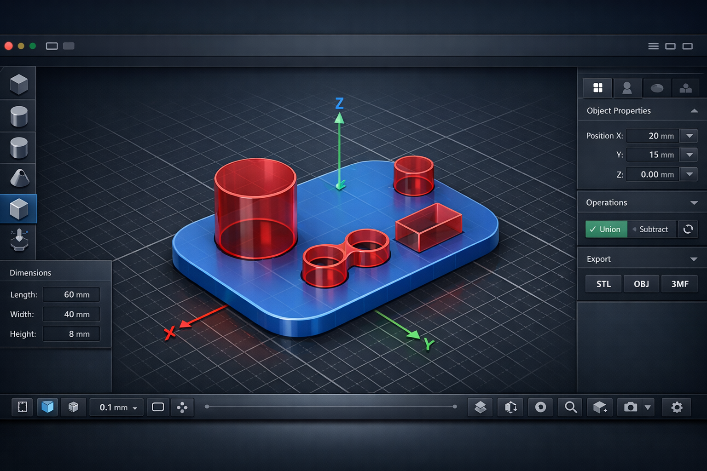

# 3D Tools CAD

**Browser CAD for practical 3D-printable parts.**

3D Tools CAD is an open-source modeling tool focused on everyday printable objects: brackets, holders, boxes, lids, organizers, labels, cable clips, fixtures, and small functional parts.



## Why This Exists

Most household 3D-printing work does not need a full professional CAD suite. It needs fast primitives, exact millimeter dimensions, reliable holes, direct modeling tools, simple boolean operations, and export that slicers understand.

3D Tools CAD aims to be a simpler Fusion 360-style workflow in the browser:

- model in millimeters;
- place solids and hole objects;
- use boolean subtract/union/intersect;
- bake the result when needed;
- export to 3MF, STL, OBJ, or editable project JSON.

## Current Capabilities

| Area | Status |
| --- | --- |
| Browser app | Vite + React + TypeScript |
| UI model | Workspace tabs for Sketch, Solid, Arrange, Inspect |
| 3D viewport | three.js with orbit and fly navigation |
| Modeling units | Millimeters in CAD state and UI |
| Primitives | Box, rounded box, cylinder, tube, sphere, wedge, text |
| Hole objects | Screw hole, slot, magnet pocket |
| Solid tools | Extrude operations, contextual Press Pull, basic Fillet |
| Transforms | Move, rotate, scale, duplicate, mirror, repeat |
| Layout tools | Align and distribute helpers |
| Boolean kernel | Manifold WASM with mesh-CSG fallback |
| Import | SVG, project JSON |
| Export | 3MF, STL, OBJ, project JSON |
| Print checks | Thin details, below-bed objects, open edges, non-manifold edges, heavy meshes, overhang hints |
| History | Undo / redo |
| Tests | Vitest suite registry with 87 tests |

## Quick Start

```bash
npm install
npm run dev
```

Open the Vite URL, usually:

```text
http://localhost:5173
```

Build:

```bash
npm run build
```

Run tests:

```bash
npm test
```

## Core Workflow

1. Start from the empty workspace.
2. Start in `Sketch` for thin profiles or `Solid` for 3D primitives.
3. Set exact size and position in millimeters.
4. Use `Extrude`, `Press Pull`, or `Fillet` to shape the selected form.
5. Add hole objects for screw holes, slots, pockets, or cutouts.
6. Choose boolean mode, usually `Subtract holes`.
7. Export directly or use `Bake boolean result`.
8. Run printability checks before slicing.
9. Save editable work as project JSON.

## Navigation

- `M`: move
- `G`: move legacy alias
- `R`: rotate
- `S`: scale
- `E`: extrude selected
- `Q`: press-pull selected
- `F`: fillet selected
- `~`: orbit/fly mode
- `W / A / S / D`: fly movement
- `Q / E`: fly down/up while Fly mode is active
- `Shift`: faster fly
- `Delete`: delete selected
- `Ctrl+D`: duplicate
- `Ctrl+Z`: undo
- `Ctrl+Y` or `Ctrl+Shift+Z`: redo

## Project Structure

```text
src/
  lib/        CAD object factories, geometry, CSG, exporters, units
  store/      Zustand CAD state and modeling actions
  ui/         React UI and three.js viewport
  test/       Vitest setup, registry, helpers, and suites
docs/         User and developer documentation
```

## Documentation

- [Documentation hub](./docs/README.md)
- [User guide](./docs/user-guide.md)
- [Architecture](./docs/architecture.md)
- [Fusion-inspired tool model](./docs/fusion-tool-model.md)
- [Geometry kernel](./docs/geometry-kernel.md)
- [File formats and export](./docs/file-formats.md)
- [Printability](./docs/printability.md)
- [Development](./docs/development.md)
- [Roadmap](./docs/roadmap.md)
- [Contributing](./CONTRIBUTING.md)

## Testing

Tests live in:

```text
src/test/suites
```

The suite registry lives in:

```text
src/test/testRegistry.ts
```

Current coverage includes CAD object creation, geometry generation, printability analysis, mesh serialization, store actions/history, Fusion-inspired store commands, exporters, unit conversion, and registry integrity.

## Documentation Rule

Documentation must be updated together with functionality changes.

If a change affects user behavior, UX, architecture, file formats, import/export, geometry kernel, printability checks, hotkeys, tests, or development workflow, update the relevant documentation in the same change.

## Roadmap Snapshot

Next high-impact areas:

- configurable repeat/array dialog;
- mirror by X/Y/Z and mirror planes;
- workplane presets and place-on-face workflow;
- object visibility/lock/grouping;
- improved SVG cleanup;
- screw and magnet presets;
- stronger wall-thickness and overhang analysis;
- import STL/OBJ as editable mesh objects.

See the full [Roadmap](./docs/roadmap.md).

## License

License is not set yet. Add one before publishing the repository publicly.
